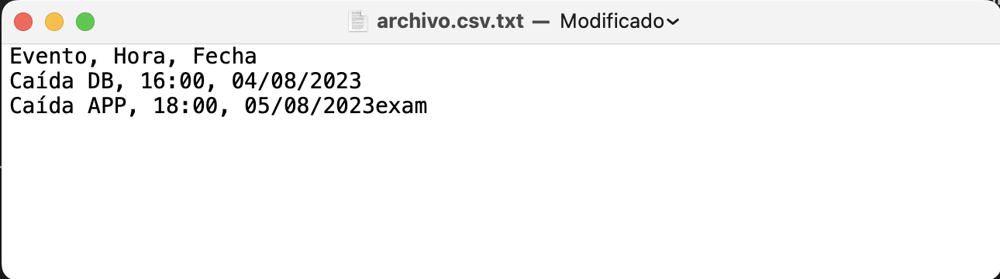
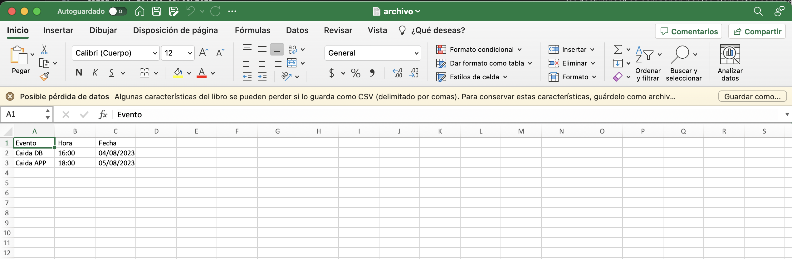
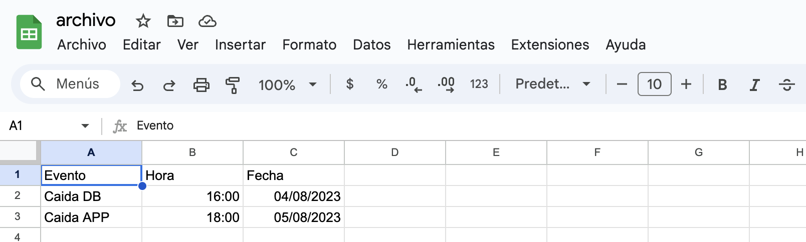

# Creación de CSV

Un CSV es, para no entrar tanto en lo técnico, un archivo que puede ser creado desde un Bloc de Notas, sólo cambiando la extensión de .txt a .csv, con la bondad de que podrá ser reconocido por Excel. 

## ¿Cómo genero uno? 

En un archivo CSV, las "filas" son la cantidad de lineas que contenga el archivo de texto, mientras que las "columnas" se componen por los elementos separados por coma. 

### Ejemplo: 

Creamos un archivo.csv con bloc de notas, y dentro añadimos el siguiente contenido: 

```
Evento, Hora, Fecha 
Caída DB, 16:00, 04/08/2023
Caída APP, 18:00, 05/08/2023
```

<br>
<p align="center">

</p>

Si ahora este archivo lo abrimos con Excel, veremos lo siguiente: 

<br>
<p align="center">

</p>

O incluso podemos cargarlo a Google Drive y abrirlo con SpreadSheets. 

<br>
<p align="center">

</p>

<br>
<p align="center">

</p>

## Bonus

Ahora que sabemos que podemos abrir archivos de texto plano con Excel, ¿por qué no crear el archivo con un script? 

```
#!/bin/bash

echo "Evento, Hora, Fecha " >> archivo.csv
echo "Caída DB, 16:00, 04/08/2023" >> archivo.csv 
echo "Caída APP, 18:00, 05/08/2023" >> archivo.csv 
```

### Y si ahora nuestro script lo variabilizamos?

```
#!/bin/bash

echo "Evento, Hora, Fecha " >> archivo.csv
echo "Caida DB, $(date +%H:%m), $(date +%d/%m/%Y)" >> archivo.csv
echo "Caida APP, $(date +%H:%m), $(date +%d/%m/%Y)" >> archivo.csv
```

## Conclusión 

Podemos automatizar la creación de archivos que nos pueden ser útiles para generar reportes a partir de datos crudos que bien pueden ser obtenidos desde línea de comandos o scripts que se encarguen de recopilarlos. :scream: 