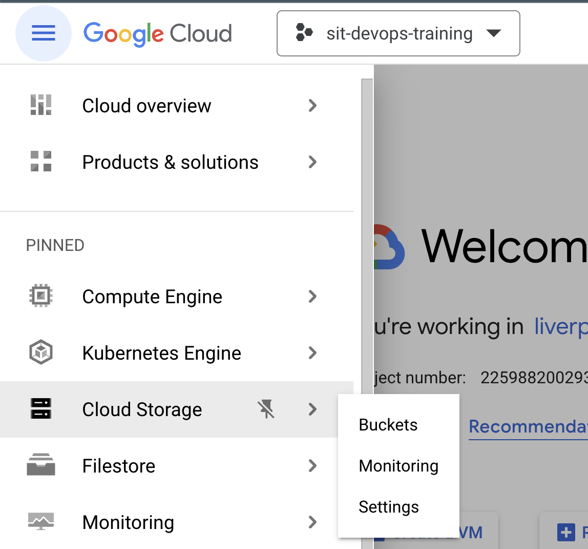
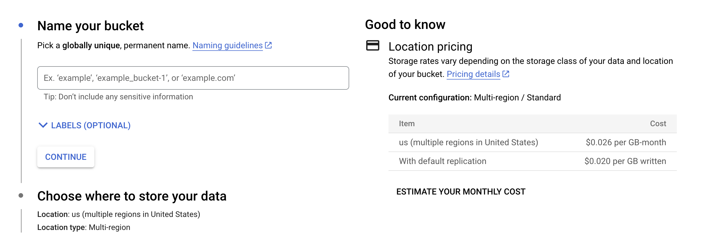
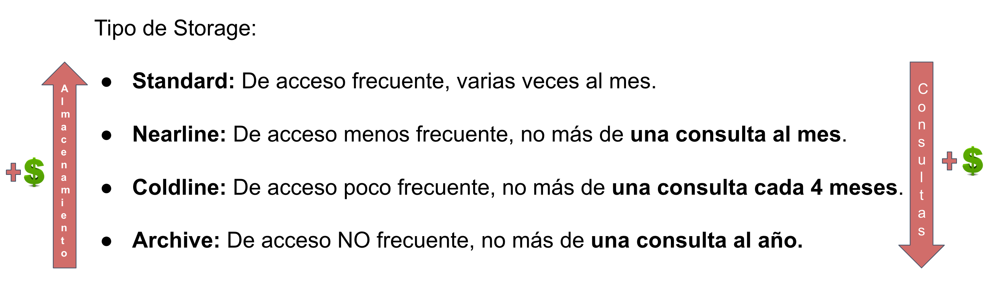
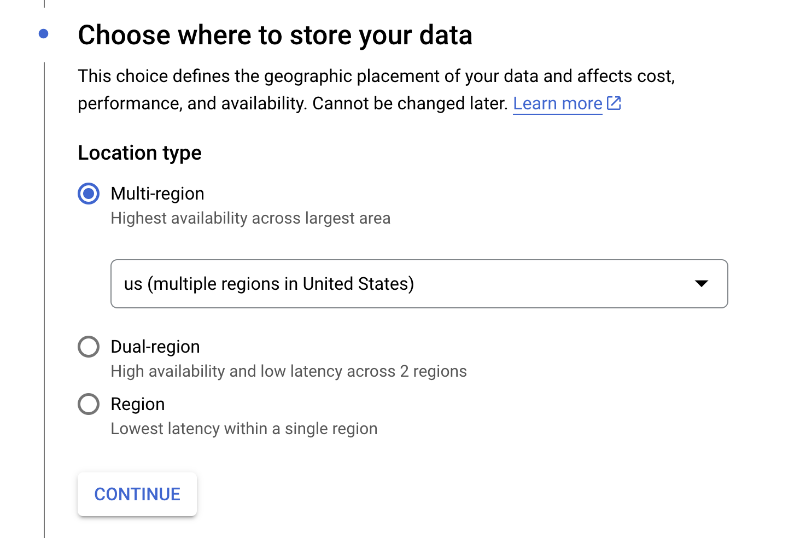
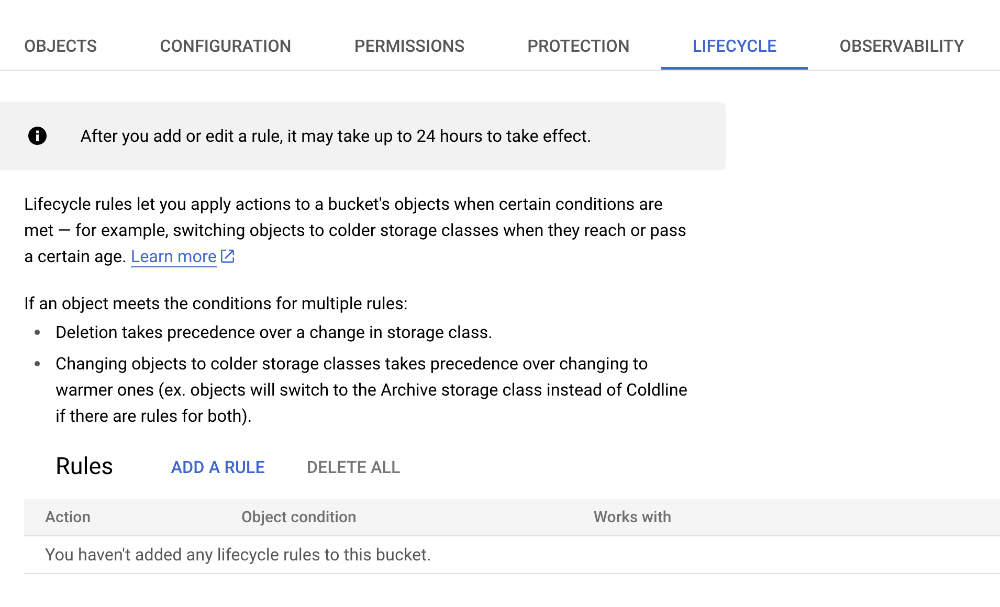
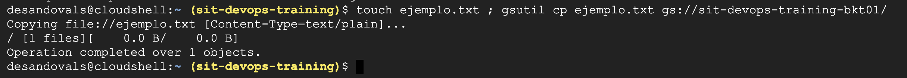

# Google Cloud Storage 

Google Cloud Storage es un componente en GCP que sirve para almacenar datos no estructurados. Es decir, podemos almacenar instaladores, imágenes, artefactos, etc. Parecido a un servidor FTP. 

<br>
<p align="center">

</p>

## ¿Cuál es la diferencia con un SFTP Server? 

Además de poder almacenar información, nos da opciones para tratar la información que estamos almacenando. Es importante mencionar que si bien no hay un servidor asociado al cual debamos declarar Filesystems, actualizar y hardenizar sistema operativo, etc, si conlleva un costo asociado que dependerá del tipo de almacenamiento, el nivel de réplica de los datos para conservar la integridad de la información, etc. Este se considera por cada 1 GB x mes. 

De forma automática la herramienta les da un estimado de lo que podría costar con base a las configuraciones que vayan declarando. 

<br>
<p align="center">

</p>

## Configuraciones

### Tipo de Almacenamiento. 

<br>
<p align="center">

</p>

### Réplica de datos

Es posible definir si queremos que los datos se repliquen a nivel de Región, entre dos regiones, o multiregión (más de dos regiones). 

<br>
<p align="center">

</p>


### Ciclo de vida del dato

Podemos habilitar las siguientes políticas: 

- **Versionamiento:** Es posible definir que cada objeto tenga “n” versiones cada que se modifica o reemplaza, ¡tal como lo hacemos en GitHub! Incluso podemos definir cuántas versiones queremos que se mantengan por objeto.
 
- **Ciclo de Vida:** Podemos definir que dadas ciertas condiciones (por ejemplo cuando se cumpla un tiempo que definamos) los objetos se borren, o se pasen a otro tipo de almacenamiento, como archiving. 

<br>
<p align="center">

</p>

- **Protección:** Podemos establecer que los objetos no puedan ser eliminados durante un periodo de tiempo que definamos. 

- **Acceso:** 

| Tipo | Descripcion |
| :--: | :--------- |
| Público | NO PERMITIDO en Liverpool. Cualquiera que tenga el link puede acceder al contenido del bucket |
| Uniform (opción recomendada) | Cuando declaremos permisos de lectura o escritura a personas o equipos, estos permisos se verán aplicados a TODOS los objetos que vivan en el bucket |
| Fine-grained | Los permisos de lectura / escritura son declarados a cada objeto dentro del bucket. | 

## Uso de comandos

*Nota: Para seguir este ejercicio, es necesario tener previamente creado un Bucket de Cloud Storage.* 

-------

Dejamos aquí algunos comandos que pueden ser usados para ver información relacionada a Buckets de Google Cloud Storage (GCS). 

Para ello, entramos a GCP

[Google Cloud Platform](https://console.cloud.google.com/)

Y en la esquina superior derecha damos clic en el icono con forma de terminal: 

<br>
<p align="center">

</p>

Una vez dentro, seleccionamos el proyecto donde deseemos trabajar. Para este ejemplo el proyecto es `sit-devops-training` y el bucket de ejemplo será el `sit-devops-training-bkt01`

```
gcloud config set project <PROJECTO>
```

Y podremos comenzar a trabajar buckets ¡con comandos!

Listar buckets: 

``` 
gsutil ls 
```

Crear un archivo de texto de nombre `ejemplo.txt` y copiarlo al bucket: 

```
touch ejemplo.txt ; gsutil cp ejemplo.txt gs://sit-devops-training-bkt01/
```

<br>
<p align="center">

</p>

:scream: ¿Se dieron cuenta que se usaron comandos de Linux?

¿Quiere decir que podemos hacer scripts que incluyan comandos de Google? :sunglasses: